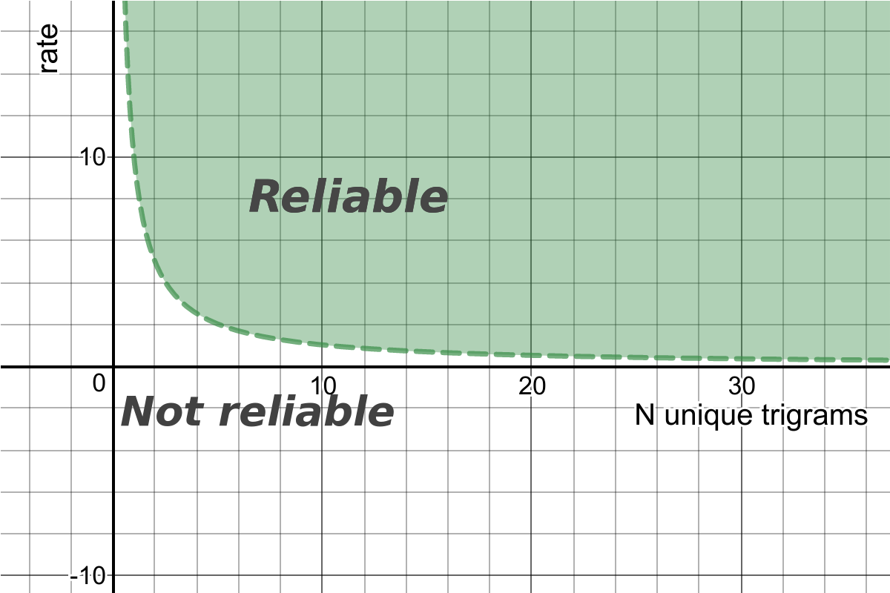

# ldt

ldt is library to automatically detect language of texts for [Go programming language](http://golang.org/).

This package was created by [abadojack](https://github.com/abadojack/whatlanggo). 
Forked by the pango project in order to incorporate bugfixes and new features.


Natural language detection for Go.
## Features
* Supports [84 languages](SUPPORTED_LANGUAGES.md)
* 100% written in Go
* No external dependencies
* Fast
* Recognizes not only a language, but also a script (Latin, Cyrillic, etc)

## Getting started
Installation:
```sh
    go get -u github.com/askasoft/pango
```

Simple usage example:
```go
package main

import (
	"fmt"

	"github.com/askasoft/pango/ldt"
)

func main() {
	info := ldt.Detect("Foje funkcias kaj foje ne funkcias")
	fmt.Println("Language:", info.Lang.String(), " Confidence: ", info.Confidence)
}
```

## Blacklisting and whitelisting
```go
package main

import (
	"fmt"

	"github.com/askasoft/pango/ldt"
)

func main() {
	//Blacklist
	options := ldt.Options{
		Blacklist: map[ldt.Lang]bool{
			ldt.Ydd: true,
		},
	}

	info := ldt.DetectWithOptions("האקדמיה ללשון העברית", options)

	fmt.Println("Language:", info.Lang.String(), "Script:", ldt.Scripts[info.Script])

	//Whitelist
	options1 := ldt.Options{
		Whitelist: map[ldt.Lang]bool{
			ldt.Epo: true,
			ldt.Ukr: true,
		},
	}

	info = ldt.DetectWithOptions("Mi ne scias", options1)
	fmt.Println("Language:", info.Lang.String(), " Script:", ldt.Scripts[info.Script])
}
```

## Requirements
Go 1.8 or higher

## How does it work?

### How does the language recognition work?

The algorithm is based on the trigram language models, which is a particular case of n-grams.
To understand the idea, please check the original whitepaper [Cavnar and Trenkle '94: N-Gram-Based Text Categorization'](https://www.researchgate.net/publication/2375544_N-Gram-Based_Text_Categorization).

### How _IsReliable_ calculated?

It is based on the following factors:
* How many unique trigrams are in the given text
* How big is the difference between the first and the second(not returned) detected languages? This metric is called `rate` in the code base.

Therefore, it can be presented as 2d space with threshold functions, that splits it into "Reliable" and "Not reliable" areas.
This function is a hyperbola and it looks like the following one:



For more details, please check a blog article [Introduction to Rust Whatlang Library and Natural Language Identification Algorithms](https://www.greyblake.com/blog/2017-07-30-introduction-to-rust-whatlang-library-and-natural-language-identification-algorithms/).

